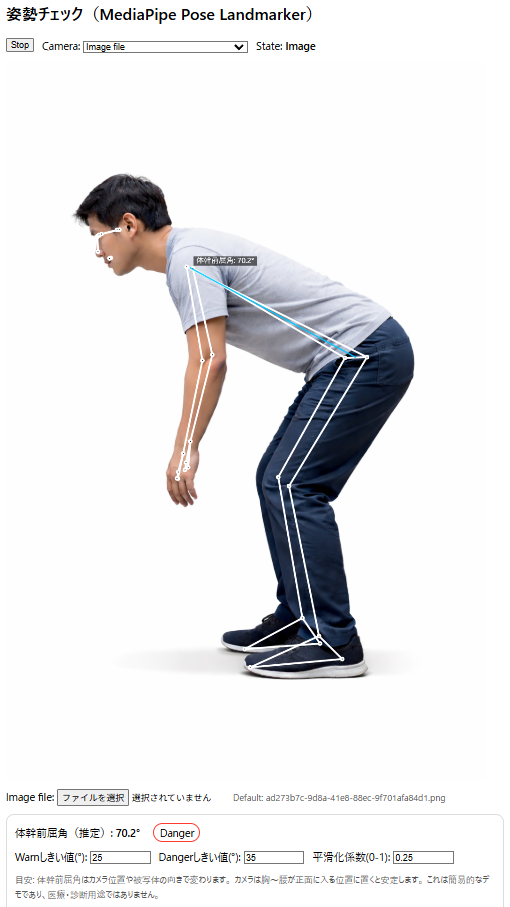

# Posture Check (MediaPipe Pose Landmarker)

ブラウザのカメラ映像から姿勢（体幹の前屈角）を推定し、角度に応じて `OK / Warn / Danger` を表示する単一ページのデモです。
MediaPipe Pose Landmarker（CDN）を使って骨格推定を行います。

## Screenshot

- 画面中央: カメラ映像または画像に骨格（ランドマーク）を重ねて表示
- 線とラベル: 肩と腰の中点を結ぶ体幹ベクトルと前屈角
- 上部: モード選択（Camera / Image file）と状態表示
- 下部: しきい値と平滑化係数の調整

## Features
- カメラ映像に骨格（ランドマーク）を描画
- 画像ファイルからの推定（Image file モード）
- 肩と腰の中点ベクトルから体幹前屈角を算出
- EMA（指数移動平均）で角度を平滑化
- 角度のしきい値を UI から調整可能
- 複数カメラの切り替え

## Requirements
- 対応ブラウザ: 最新版の Chrome / Edge / Safari など
- カメラへのアクセス許可が必要
- インターネット接続（MediaPipe の CDN を利用）

## Quick Start
1. このリポジトリを開く
2. `index.html` をブラウザで開く
3. カメラ許可を与える
4. `Start` を押して計測を開始

## How It Works
- 肩（11, 12）と腰（23, 24）のランドマークから中点を計算
- `hipCenter -> shoulderCenter` のベクトルが鉛直方向からどれだけ傾いたかを角度として算出
- `Warn` / `Danger` のしきい値と比較して表示を更新

## Controls
- `Warn(°)` / `Danger(°)`: 角度しきい値
- `Smoothing(0-1)`: EMA の係数（大きいほど追従、小さいほど滑らか）
- `Camera` セレクト: `Image file` を選ぶと画像モード
- 画像モード時の `Image file` ボタンで任意画像を選択

## Image Mode
1. `Camera` セレクトで `Image file` を選択
2. デフォルト画像 `ad273b7c-9d8a-41e8-88ec-9f701afa84d1.png` が読み込まれる
3. `Image file` ボタンで任意の画像を選択

## Notes
- 2D の姿勢推定なので、カメラの角度や被写体の向きによって値が変動します。
- 照明や服装、被写体の位置によって検出精度が変わる場合があります。

## Troubleshooting
- **カメラが一覧に表示されない**: 一度 `Start` を押して許可を与えると `label` が表示されます。
- **画面が黒い**: 他アプリがカメラを使用していないか確認してください。
- **角度が常に `-`**: 体が画面内に収まっているか、照明が十分かを確認してください。

## File Structure
- `index.html` : メインページ（HTML/CSS/JS 一体型）
